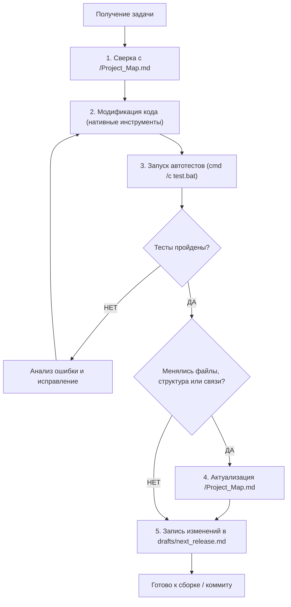

# Регламент для ИИ-агентов (AI Agent Directives)

> **Статус**: Обязательная системная инструкция. Действует для любых ИИ-агентов и ассистентов, взаимодействующих с репозиторием Hosts Launcher & Manager.

---

## 1. Главный инвариант: Актуализация Карты Проекта

1. **Единый источник архитектурной правды**:
   Файл [`/Project_Map.md`](/Project_Map.md) является абсолютным эталоном архитектуры, состава компонентов и дерева файлов репозитория.

2. **Обязанность агента**:
   Любой агент **ОБЯЗАН поддерживать актуальность [`/Project_Map.md`](/Project_Map.md)** при ЛЮБЫХ изменениях в проекте:
   - Добавление, переименование, перемещение или удаление файлов и папок;
   - Изменение назначения компонентов или связей между модулями;
   - Добавление новых тестов, пресетов, параметров конфигурации или CLI-аргументов.

3. **Синхронность фиксации**:
   Изменения в коде и актуализация [`/Project_Map.md`](/Project_Map.md) производятся **в рамках единой задачи**, до выполнения коммита и выпуска релиза.

---

## 2. Стандарты работы с кодовой базой

### 2.1. Инструменты и кодировки (BOM Safety)
* Редактирование, создание и перемещение файлов осуществляется **ТОЛЬКО** через нативные инструменты среды разработки (`write_to_file`, `replace_file_content`, `mcp_file-operations_move_file`).
* **Категорически запрещено** использовать консольные перенаправления (`>`, `>>`, `Out-File`, `Set-Content`), способные исказить кодировку файлов или добавить некорректный Windows BOM.
* Консоль (`run_command`) предназначена исключительно для выполнения исполняемых файлов, тестов, сборки и git-команд.

### 2.2. Архитектурные ограничения
* **Нулевые внешние зависимости**: Проект компилируется автономно через `csc.exe` (.NET Framework 4.8) без NuGet-пакетов. Использовать только стандартные системные сборки.
* **Изоляция файла hosts**: Персональные пользовательские строки в `hosts` неприкосновенны. Управление источниками выполняется строго внутри именованных блоков `# === BEGIN HOSTS-MANAGER MANAGED BLOCK: <Name> ===`.
* **Паритет локализации**: Любая новая строка интерфейса в [`/src/Localization/L10n.cs`](/src/Localization/L10n.cs) должна иметь идентичные ключи в словарях `ru` и `en`.
* **Адаптивная верстка окна**: Базовый размер при первом запуске — `690 × 780 px`. При ресайзе сжимается и растягивается исключительно каталог подписок (`gbCustom` / `pnlCustomProviders`).

---

## 3. Рабочий цикл агента (Operational Loop)

### Чеклист перед завершением задачи:
- [ ] Все 11 тестов в [`/test.bat`](/test.bat) завершаются с кодом 0 (`[SUCCESS] ALL 11 TESTS PASSED CLEANLY!`).
- [ ] Если затронута файловая структура или сигнатуры сервисов — обновлено дерево и схемы в [`/Project_Map.md`](/Project_Map.md).
- [ ] Описание добавленных фич / фиксов зафиксировано в двуязычном черновике [`/drafts/next_release.md`](/drafts/next_release.md).
- [ ] Сборка [`/build.bat`](/build.bat) завершается без предупреждений и ошибок компилятора.
- [ ] Сообщение коммита сформулировано без скобок (совместимость с `Github_Sync.py`).
