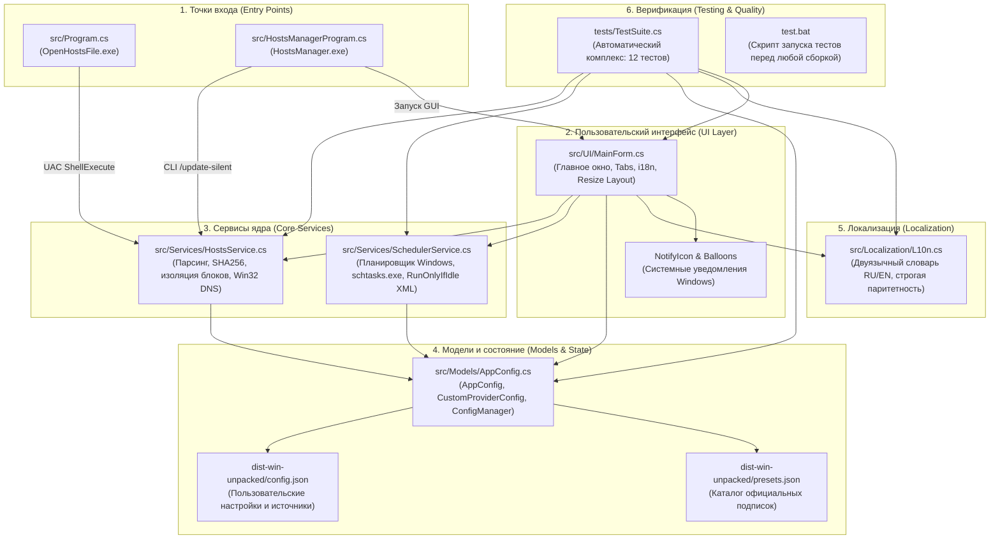
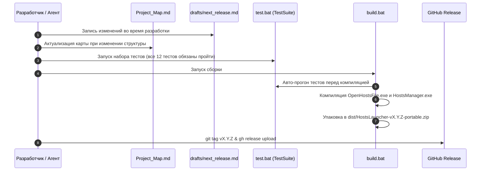

# Карта проекта Hosts Launcher & Manager (Project Map)

> **Статус документа**: Единый источник правды (SSOT) об архитектуре, структуре каталогов, компонентах и взаимосвязях проекта.  
> **Обязательное правило для ИИ-агентов**: Любой агент, вносящий изменения в файловую структуру, состав классов, сервисы или логику приложения, **обязан актуализировать данный файл** синхронно с правками кода.

---

## 1. Общие сведения и стек

* **Название проекта**: Hosts Launcher & Manager
* **Версия**: См. актуальное значение в [`/version.json`](/version.json)
* **Платформа**: Windows 10 / Windows 11 (x64 / x86)
* **Стек технологий**: C# (.NET Framework 4.8), Windows Forms, Win32 API / PInvoke
* **Сборка**: Автономная компиляция через `csc.exe` (без тяжелых IDE и MSBuild), скрипты [`/build.bat`](/build.bat) и [`/test.bat`](/test.bat)
* **Зависимости**: Нулевые внешние зависимости (`Zero External Dependencies`). Используются только встроенные библиотеки ОС: `System.Windows.Forms.dll`, `System.Drawing.dll`, `System.Web.Extensions.dll` (сериализация JSON).

---

## 2. Архитектурные уровни и компоненты



### Назначение модулей:
1. **Точки входа (`Entry Points`)**:
   - [`/src/Program.cs`](/src/Program.cs): Легковесный быстрый раннер (`OpenHostsFile.exe`, ~15 КБ). Задача: запуск редактора с правами администратора (`runas`), открытие hosts и мгновенный выход без удержания памяти.
   - [`/src/HostsManagerProgram.cs`](/src/HostsManagerProgram.cs): Основная программа (`HostsManager.exe`). Обрабатывает CLI-аргументы (`/update-silent`, `/manage`, `/open-hosts`, `/openwith`) или открывает графический интерфейс.
2. **Слой представления (`UI Layer`)**:
   - [`/src/UI/MainForm.cs`](/src/UI/MainForm.cs): Windows Forms интерфейс. Две вкладки: «Создать ярлык» и «Подписки и автообновление». Содержит классическую нативную верстку Windows Forms, адаптивную систему компоновки (`LayoutHeader`, `LayoutProvidersTab`, `LayoutShortcutsTab`), сохраняющую размеры `WindowWidth`/`WindowHeight` в `config.json` и динамически центрирующую контролы.
3. **Сервисы ядра (`Core Services`)**:
   - [`/src/Services/HostsService.cs`](/src/Services/HostsService.cs): Изоляция подписок управляемыми маркерами `# === BEGIN HOSTS-MANAGER MANAGED BLOCK: <Name> ===`, сохранение пользовательских записей, проверка хеша SHA256 (защита от лишней перезаписи диска), автоматический бэкап `hosts.bak`, сброс DNS через WinAPI `dnsapi.dll!DnsFlushResolverCache` + `ipconfig /flushdns`.
   - [`/src/Services/SchedulerService.cs`](/src/Services/SchedulerService.cs): Взаимодействие со службой Планировщика Windows (`schtasks.exe`). Модифицирует XML задачи для инъекции флага `<RunOnlyIfIdle>true</RunOnlyIfIdle>` (обновление строго при простое ПК) и декодирует консольный вывод `schtasks.exe` в системной OEM-кодировке (CP866) для защиты от кракозябр в локализованных ОС.
4. **Модели и конфигурация (`Models & State`)**:
   - [`/src/Models/AppConfig.cs`](/src/Models/AppConfig.cs): Модели `AppConfig`, `CustomProviderConfig`. Статический класс `ConfigManager` обеспечивает раздельное хранение каталога официальных подписок ([`dist-win-unpacked/presets.json`](/dist-win-unpacked/presets.json)) и пользовательского состояния ([`dist-win-unpacked/config.json`](/dist-win-unpacked/config.json)), отслеживает удаленные пресеты (`RemovedPresetIds`) и реализует трехуровневый сброс (восстановление пресетов с сохранением кастомных источников, удаление только кастомных источников, полный сброс).
5. **Локализация (`Localization`)**:
   - [`/src/Localization/L10n.cs`](/src/Localization/L10n.cs): Единый словарь строк для русского и английского языков. Полная паритетность ключей RU ⟷ EN гарантируется автотестом.
6. **Автоматическое тестирование (`Testing`)**:
   - [`/tests/TestSuite.cs`](/tests/TestSuite.cs): Комплекс из 12 автоматических тестов без сторонних тестовых фреймворков. Проверяет хеширование, парсинг и изолированное удаление блоков hosts, корректность инъекции XML планировщика, паритет словарей, разделение пресетов и кастомных источников, непустые контролы интерфейса на обоих языках и адаптивное вертикальное растяжение окна.

---

## 3. Файловое дерево репозитория

```text
HostsLauncher/
│
├── .gitignore                       # Исключения Git (директории dist/, временные файлы, кэш)
├── LICENSE                          # Лицензия проекта (MIT)
├── README.md                        # Двуязычная документация пользователя (RU / EN)
├── Project_Map.md                   # Данный документ: архитектурная карта и SSOT структуры
├── AGENT.md                         # Регламент и системная инструкция для ИИ-агентов
├── version.json                     # Единый источник правды о версии (SemVer: X.Y.Z)
├── CHANGELOG.md                     # Журнал изменений (Keep a Changelog, двуязычный)
├── build.bat                        # Идемпотентный сборочный скрипт (тесты -> csc -> dist/)
├── test.bat                         # Компиляция и запуск тестового набора TestSuite
│
├── docs/                            # Документация и скриншоты для README
│   └── screenshots/                 # Графические иллюстрации работы интерфейса
│
├── drafts/                          # Черновики разработки
│   └── next_release.md              # Накопительный журнал изменений до публикации релиза
│
├── resources/                       # Ресурсы, графика и иконки приложения
│   ├── app.ico                      # Основная иконка приложения Hosts Manager (щит с планетой)
│   ├── sync.ico                     # Иконка для ярлыка быстрого обновления (щит со стрелками)
│   ├── icon.png                     # Логотип для шапки README.md
│   └── *.png, *.ico                 # Исходные графические материалы для сборщика
│
├── src/                             # Исходный код C# (.NET Framework 4.8)
│   ├── Program.cs                   # Точка входа OpenHostsFile.exe (быстрый раннер для панели задач)
│   ├── HostsManagerProgram.cs       # Точка входа HostsManager.exe (GUI и CLI обработчик)
│   │
│   ├── Localization/
│   │   └── L10n.cs                  # Двуязычный словарь и механизм форматирования строк
│   │
│   ├── Models/
│   │   └── AppConfig.cs             # DTO настроек, встроенные пресеты, ConfigManager
│   │
│   ├── Services/
│   │   ├── HostsService.cs          # Бизнес-логика hosts: блоки, хеши, бэкап, flush DNS
│   │   └── SchedulerService.cs      # Интеграция с Планировщиком Windows (schtasks, XML)
│   │
│   └── UI/
│       └── MainForm.cs              # Окно управления, динамическая верстка, Toast/Balloon
│
├── tests/                           # Комплекс автотестов
│   └── TestSuite.cs                 # Исходный код автономного тестового раннера (12 проверок)
│
├── dist-win-unpacked/               # Распакованные рабочие бинарники (для локального теста)
│   ├── OpenHostsFile.exe            # Скомпилированный раннер
│   ├── HostsManager.exe             # Скомпилированная панель управления
│   ├── presets.json                 # Каталог предустановленных подписок (обновляется с версиями)
│   └── config.json                  # Пользовательская конфигурация (сохраняется при обновлениях)
│
└── dist/                            # Каталог готовых упакованных релизов (.gitignore)
    └── HostsLauncher-v*.zip         # Портативные zip-архивы для выгрузки на GitHub Releases
```

---

## 4. Жизненный цикл и сквозные сценарии (Lifecycles)

### 4.1. Сценарий: Релизный пайплайн проекта


### 4.2. Сценарий: Синхронизация подписок (UI и CLI)
1. Вызов метода `HostsService.UpdateAllActiveProviders(config, progressCallback)`.
2. Скачивание правил из активных URL (GeoHide + отмеченные пользовательские источники).
3. Проверка SHA256 хеша содержимого: если контент не изменился, перезапись файла hosts пропускается (минимизация износа диска).
4. Если есть изменения:
   - Создание резервной копии `C:\Windows\System32\drivers\etc\hosts.bak`.
   - Точечная замена блоков `# === BEGIN HOSTS-MANAGER MANAGED BLOCK: <Name> === ... # === END HOSTS-MANAGER MANAGED BLOCK: <Name> ===`.
   - Все персональные строки вне этих маркеров сохраняются без изменений.
   - Атомарная запись в `hosts` (с автоматическим повышением прав через временный скрипт при необходимости).
   - Вызов `dnsapi.dll!DnsFlushResolverCache` и `ipconfig /flushdns`.
   - В UI: отправка ненавязчивого системного всплывающего уведомления Windows (BalloonTip/Toast).

---

## 5. Инварианты и правила кодовой базы

1. **Правило изоляции hosts**: Программе категорически запрещено перезаписывать файл hosts целиком. Допускается модификация исключительно блоков, ограниченных служебными маркерами приложения.
2. **Правило нулевых внешних зависимостей**: Запрещено подключать внешние NuGet-пакеты или сторонние DLL. Сборка должна гарантированно выполняться стандартным компилятором `csc.exe` на чистой ОС Windows.
3. **Правило паритета локализации**: При добавлении любого строкового ключа в [`/src/Localization/L10n.cs`](/src/Localization/L10n.cs) ключ обязан быть добавлен одновременно в секции `"ru"` и `"en"`. Паритет автоматически валидируется тестом `Test_L10n_ParityAndCompleteness`.
4. **Правило адаптивной верстки**: Размеры по умолчанию зафиксированы на `690 × 780 px`. При изменении габаритов формы сжимается или растягивается **строго** контейнер `gbCustom` (`pnlCustomProviders`). Верхний блок GeoHide и нижние блоки управления сохраняют фиксированную высоту.
5. **Правило работы с файлами в репозитории**: Все изменения вносятся строго с сохранением кодировки UTF-8 (без повреждения Windows BOM). Запрещено использовать перенаправление консоли (`>`, `Out-File`) для генерации файлов проекта.
