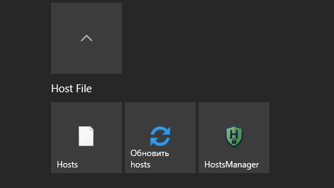
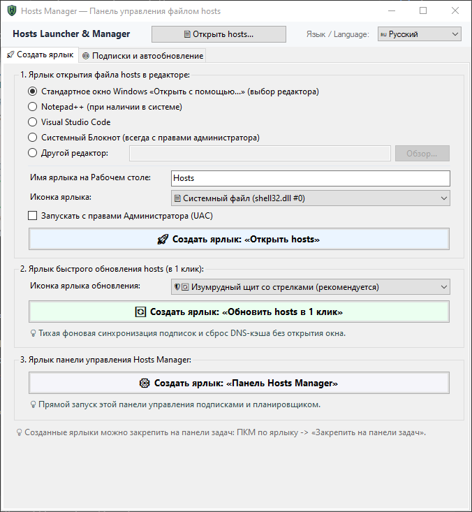
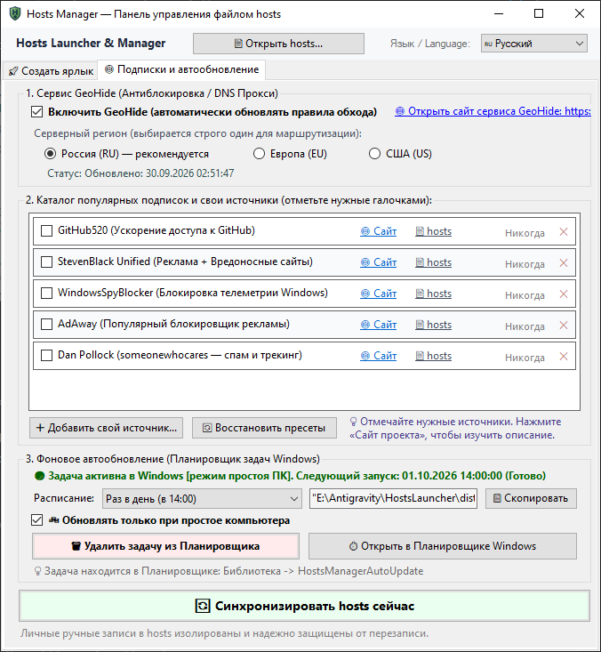
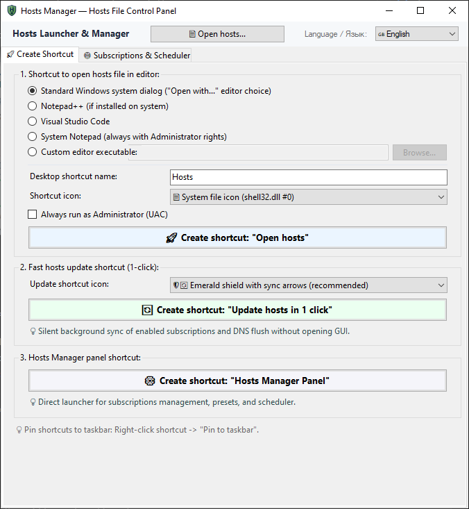
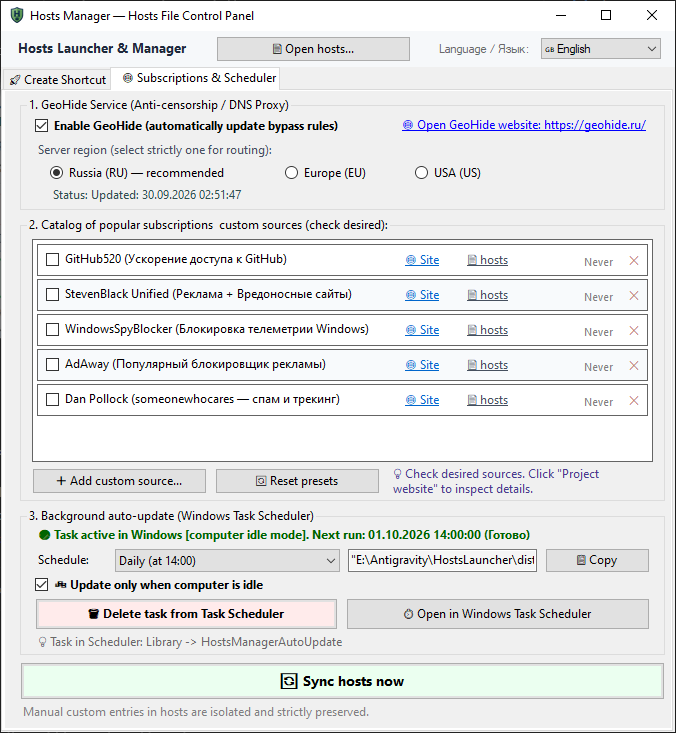

<div align="center">
  
  <h1>Hosts Launcher & Manager</h1>
  <p><b>Мгновенный запуск hosts из меню «Пуск» Windows, автосинхронизация подписок и умный планировщик</b></p>
</div>

[Русский](#русский) | [English](#english)

> ⚡ **Легковесная портативная утилита для Windows 10/11**: Мгновенный доступ к системному файлу hosts прямо из меню «Пуск» (или панели задач), автоматические подписки (GeoHide, блокировщики рекламы и телеметрии) и тихий планировщик обновлений.
> 
> **Lightweight portable utility for Windows 10/11**: Instant Start Menu access to the system hosts file, automated subscriptions (GeoHide, ad & telemetry blockers), and silent background scheduler.

---

## Русский

**Hosts Launcher & Manager** — портативный набор инструментов для Windows, позволяющий открывать системный файл hosts в один клик прямо из меню «Пуск» (или панели задач) в выбранном редакторе с правами администратора, управлять проверенными подписками правил обхода и блокировки рекламы и автоматически синхронизировать их в фоновом режиме.

👉 **[Скачать свежий релиз (portable .zip)](https://github.com/MaximXR/hosts-file-manager/releases/latest)** • Портативно • Без установки • Открытый исходный код

---

### Какие проблемы решает программа?

Файл `hosts` в Windows необходим для быстрого доступа к сервисам через умные DNS (без тяжелого VPN), блокировки трекеров и веб-разработки. Но ручная работа с ним полна системной рутины:

1. **Глубокий системный путь и ошибки UAC в Блокноте**  
   Файл спрятан в `C:\Windows\System32\drivers\etc\hosts`. Искать его каждый раз в Проводнике долго, а стандартный Блокнот не повышает права на лету: при сохранении через `Ctrl+S` вы получаете «Отказано в доступе» или бесполезный `hosts.txt`.  
   👉 **Решение:** Программа создает ярлыки для мгновенного закрепления в меню «Пуск», на панели задач или Рабочем столе. Файл открывается в 1 клик сразу с правами администратора в любом удобном редакторе (VS Code, Notepad++, Блокнот). А кнопка `[📄 Открыть hosts...]` в шапке окна позволяет быстро открыть файл без создания ярлыков.

2. **Ручной ввод настроек для сервисов (умные DNS вместо VPN)**  
   Чтобы сервисы и инструменты разработки (GitHub, Discord, базы данных, ИИ-платформы) работали стабильно, используют специальные маршруты и быстрые DNS. Но адреса периодически меняются, и обновлять их вручную с сайтов утомительно.  
   👉 **Решение:** Встроенный каталог проверенных подписок (GeoHide с выбором региона, GitHub520, фильтры рекламы StevenBlack, AdAway, Dan Pollock) и добавление любых своих URL. Обновление выполняется в 1 клик из окна или через специальный ярлык на Рабочем столе.

3. **Затирание личных записей при обновлении правил**  
   Большинство сторонних скриптов заменяют файл hosts целиком, стирая ручные локальные записи разработчиков (`localhost`, рабочие стенды, тестовые домены).  
   👉 **Решение:** Встроенный движок изолирует каждую подписку в строгий блок `# === BEGIN HOSTS-MANAGER MANAGED BLOCK ===`. Персональные строки всегда остаются нетронутыми, а перед каждой перезаписью создается резервная копия `hosts.bak`.

4. **Забытый сброс DNS-кэша**  
   После ручной правки hosts операционная система и браузеры продолжают обращаться по старым закэшированным IP-адресам.  
   👉 **Решение:** Автоматический сброс кэша через прямой вызов Win32 API (`DnsFlushResolverCache` в `dnsapi.dll` + `ipconfig /flushdns`) сразу при обновлении. Новые настройки применяются моментально без перезагрузки системы.

5. **Сетевые лаги во время онлайн-игр и работы**  
   Обычные фоновые планировщики обновляют правила в любой случайный момент, вызывая фризы в играх и прерывая связь в созвонах.  
   👉 **Решение:** Задача автообновления в Планировщике Windows создается с системным условием `RunOnlyIfIdle` — фоновая синхронизация запускается исключительно во время простоя компьютера.

> 📝 Подробная история релизов и изменений по версиям: [CHANGELOG.md](CHANGELOG.md).

---

### Скриншоты интерфейса

<div align="center">
  <p><b>Быстрый доступ к hosts и синхронизация прямо из меню «Пуск» Windows:</b></p>
  
  <br/><br/>
  <table>
    <tr>
      <td align="center"><b>Вкладка 1: Создание ярлыков</b></td>
      <td align="center"><b>Вкладка 2: Подписки и планировщик</b></td>
    </tr>
    <tr>
      <td></td>
      <td></td>
    </tr>
  </table>
</div>

---

### Основные возможности

* 🚀 **Быстрый доступ и генератор ярлыков (меню «Пуск», панель задач, Рабочий стол):**
  * **Кнопка в шапке `[📄 Открыть hosts...]`:** мгновенный запуск системного диалога «Открыть с помощью...» прямо из интерфейса без создания ярлыка.
  * **Ярлык на открытие hosts:** выбор редактора (системный Блокнот с UAC, Notepad++, VS Code или любой указанный `.exe`) и системной иконки (`shell32.dll #0`, Блокнот или Notepad++). Ярлык готов к закреплению в меню «Пуск» или на панели задач в 1 клик.
  * **Ярлык «Обновить hosts в 1 клик» (`/update-now`):** тихая фоновая синхронизация подписок и сброс DNS с нативным системным push-уведомлением Windows (без назойливых модальных окон).
  * **Ярлык панели управления:** быстрый запуск настроек `HostsManager.exe`.
* 🌐 **Каталог проверенных подписок и свои источники:**
  * **GeoHide:** удобный выбор региона маршрутизации (`Россия (RU) — рекомендуется`, `Европа (EU)` или `США (US)`) и прямой переход на официальный сайт сервиса.
  * **Каталог пресетов в 1 клик:** GitHub520 (ускорение доступа к GitHub), StevenBlack Unified (реклама и вредоносные сайты), WindowsSpyBlocker (блокировка телеметрии Windows), AdAway и Dan Pollock (спам и трекинг).
  * **Добавление собственных источников:** подключение любых ссылок с правилами hosts (raw `.txt`), возможность изучить сайт проекта и восстановить пресеты по умолчанию.
  * **Надежная защита данных:** изоляция в маркированные блоки и автоматическое создание `hosts.bak`.
* ⏱️ **Управление Планировщиком Windows:**
  * **Гибкая периодичность:** каждый день (в 09:00 или 14:00), каждые 6 / 12 часов, при входе в систему или при простое ПК.
  * **Опция «💤 Обновлять только при простое компьютера» (`RunOnlyIfIdle`):** синхронизация не мешает онлайн-играм, просмотру видео и работе.
  * **Управление и мониторинг:** динамический статус задачи (`🟢 Задача активна...`), кнопка копирования строки вызова и быстрый переход в системную оснастку `taskschd.msc`.
* 📦 **Портативность и интерфейс:**
  * **Двуязычный интерфейс (i18n):** мгновенное переключение языка (`🇷🇺 Русский` / `🇬🇧 English`) прямо в шапке окна без перезапуска программы. Настройка сохраняется в `config.json`.
  * **100% Portable:** настройки хранятся рядом с `.exe`. Программа не оставляет записей в реестре Windows.

---

### Архитектура проекта

```text
HostsLauncher/
├── src/
│   ├── Models/AppConfig.cs        # Конфигурация, пресеты, JSON
│   ├── Localization/L10n.cs       # Словари RU/EN, переводчик
│   ├── Services/HostsService.cs   # Парсинг hosts, изоляция блоков, сброс DNS
│   ├── Services/SchedulerService.cs # Планировщик Windows, RunOnlyIfIdle
│   ├── UI/MainForm.cs             # Графический интерфейс Windows Forms
│   ├── HostsManagerProgram.cs     # Точка входа HostsManager.exe
│   └── Program.cs                 # Точка входа OpenHostsFile.exe (быстрый раннер)
├── docs/
│   └── screenshots/               # Скриншоты интерфейса для документации
├── tests/
│   └── TestSuite.cs               # Автоматический тестовый комплекс (12 тестов)
├── dist-win-unpacked/             # Готовые бинарники для работы
│   ├── OpenHostsFile.exe          # Легковесный раннер (запуск редактора с UAC)
│   ├── HostsManager.exe           # Графическая панель управления
│   ├── presets.json               # Каталог стандартных подписок
│   └── config.json                # Портативная конфигурация (без реестра Windows)
├── dist/                          # Скомпилированные релизные zip-архивы
├── test.bat                       # Скрипт сборки и запуска автотестов
├── build.bat                      # Сборка с автотестами и упаковка в dist/
├── version.json                   # Единый источник версии проекта (SemVer)
├── CHANGELOG.md                   # Двуязычная история изменений (RU / EN)
├── LICENSE                        # Лицензия MIT
├── .gitignore
└── README.md
```

---

### Установка и запуск

1. Скачайте архив со страницы **[последнего релиза](https://github.com/MaximXR/hosts-file-manager/releases/latest)**.
2. Распакуйте содержимое архива в любую постоянную папку (например, `C:\Tools\HostsLauncher` или `%USERPROFILE%\Tools\HostsLauncher`).
3. Запустите `HostsManager.exe`, настройте удобный редактор и нажмите кнопку **«🚀 Создать ярлык для файла hosts»**.
4. Нажмите правой кнопкой мыши по созданному ярлыку на Рабочем столе ➔ **«Закрепить на начальном экране» (в меню «Пуск»)** или **«Закрепить на панели задач»**.

> 💡 **Сборка из исходников:**  
> Для компиляции проекта не требуются сторонние SDK или тяжелая Visual Studio. Запустите `build.bat` в корне проекта — он использует штатный компилятор C# (`csc.exe`) из состава .NET Framework 4.x, присутствующий в Windows 10/11 по умолчанию.

---

### Используете hosts для работы с нейросетями?

Если вы настраиваете файл `hosts` для стабильного доступа к зарубежным ИИ-сервисам, API и инструментам разработки в России без медленных VPN, рекомендую обратить внимание на другие мои проекты для экосистемы ИИ-разработки (Antigravity):

* **[Antigravity Chat Manager](https://github.com/MaximXR/Antigravity-Chat-Manager)** — визуальный менеджер истории диалогов с ИИ: глубокий поиск по сессиям и очистка диска от гигабайтов кэша и мусора.
* **[Antigravity Plugin Manager](https://github.com/MaximXR/Antigravity-Plugin-Manager)** — единая панель управления плагинами, системными инструкциями (rules), навыками (skills) и MCP-серверами.

---

## English

**Hosts Launcher & Manager** is a portable Windows utility suite designed to launch the system hosts file in your preferred text editor with Administrator privileges in a single click directly from the Windows Start Menu (or taskbar), manage curated anti-censorship and ad-blocking subscriptions, and synchronize rules automatically in the background.

👉 **[Download Latest Release (portable .zip)](https://github.com/MaximXR/hosts-file-manager/releases/latest)** • Portable • No installation required • Open Source

---

### Problems Solved by Hosts Launcher

The Windows `hosts` file is essential for developers and power users to configure fast smart-DNS routing (bypassing heavy VPNs), block trackers, and route local development environments. However, managing it manually is full of system friction:

1. **Buried System Path & UAC Elevation Errors in Notepad**  
   The file is tucked away at `C:\Windows\System32\drivers\etc\hosts`. Browsing to it or typing the path manually is slow. Standard Notepad cannot elevate privileges on the fly: hitting `Ctrl+S` fails with «Access Denied» or saves a useless `hosts.txt` copy.  
   👉 **Solution:** The utility generates shortcuts ready to pin directly to the Start Menu, Taskbar, or Desktop. The file launches in 1 click with Administrator privileges in your favorite editor (VS Code, Notepad++, Notepad). A direct `[📄 Open hosts...]` button in the window header lets you open the file instantly without generating shortcuts.

2. **Manual Configuration for Developer Services (Smart DNS vs Heavy VPN)**  
   Keeping critical developer tools (GitHub, Discord, Docker, AI platforms) accessible without connection drops often requires specific routing and smart-DNS endpoints. Manually copy-pasting addresses from websites is repetitive.  
   👉 **Solution:** Curated built-in subscriptions (GeoHide with region selection, GitHub520, StevenBlack, AdAway, Dan Pollock) plus custom URL support. Synchronize everything in 1 click from the GUI or via a dedicated Desktop shortcut.

3. **Loss of Custom Domain Mappings During Rule Updates**  
   Most third-party scripts wipe out the entire `hosts` file, erasing your local development entries (`localhost`, custom vhosts, and internal test domains).  
   👉 **Solution:** The built-in sync engine encloses each subscription inside dedicated `# === BEGIN HOSTS-MANAGER MANAGED BLOCK ===` boundaries. Personal entries remain untouched, and a safety backup `hosts.bak` is generated prior to every write.

4. **Stale DNS Resolution Cache**  
   After modifying hosts, the Windows resolver and web browsers frequently keep cached obsolete IP mappings.  
   👉 **Solution:** The manager automatically flushes DNS records using native Windows API (`DnsFlushResolverCache` in `dnsapi.dll` + `ipconfig /flushdns`). New rules take effect immediately without restarting your browser or PC.

5. **Network Latency During Active Gaming and Work**  
   Standard background task schedulers trigger at arbitrary moments, causing network jitter and packet loss during gaming or calls.  
   👉 **Solution:** The Windows Task Scheduler task is configured with the native `RunOnlyIfIdle` condition — background synchronization runs strictly when the computer is idle.

> 📝 For a complete version-by-version release history, see [CHANGELOG.md](CHANGELOG.md).

---

### Screenshots

<div align="center">
  <p><b>Fast hosts access and 1-click update tile group in Windows Start Menu:</b></p>
  
  <br/><br/>
  <table>
    <tr>
      <td align="center"><b>Tab 1: Shortcut Generator</b></td>
      <td align="center"><b>Tab 2: Subscriptions & Scheduler</b></td>
    </tr>
    <tr>
      <td></td>
      <td></td>
    </tr>
  </table>
</div>

---

### Key Features

* 🚀 **Fast Access & Shortcut Generator (Start Menu, Taskbar, Desktop):**
  * **Header `[📄 Open hosts...]` button:** launches the native Windows "Open with..." dialog directly from any tab without creating shortcuts.
  * **Hosts Shortcut:** choose your editor (Notepad with UAC, Notepad++, VS Code, or custom `.exe`) and shell icon (`shell32.dll #0`, Notepad, or Notepad++). Ready to pin to the Start Menu or taskbar in 1 click.
  * **1-Click Sync Shortcut (`/update-now`):** silent background subscription refresh and DNS flush from your desktop or Start Menu with a non-blocking Windows push notification.
  * **Hosts Manager Shortcut:** instant access to the configuration GUI.
* 🌐 **Curated Subscription Catalog & Custom Endpoints:**
  * **GeoHide:** choose your routing region (`Russia (RU) — recommended`, `Europe (EU)`, or `USA (US)`) with direct links to the official service website.
  * **1-Click Built-in Presets:** GitHub520 (accelerate GitHub access), StevenBlack Unified (ad & malware blocklist), WindowsSpyBlocker (blocks Windows telemetry), AdAway, and Dan Pollock (spam & tracker filters).
  * **Custom Sources:** add any raw `.txt` hosts endpoint, inspect project homepages, and restore presets in 1 click.
  * **Data Protection:** isolated managed blocks and automatic `hosts.bak` safety backups.
* ⏱️ **Task Scheduler Integration:**
  * **Flexible Schedules:** daily (09:00 or 14:00), every 6 / 12 hours, at Windows logon, or when idle.
  * **«💤 Update only when computer is idle» (`RunOnlyIfIdle`):** ensures zero network interference during gaming, video streaming, or work.
  * **Management & Monitoring:** real-time task status (`🟢 Task active...`), copy command button, and direct link to Windows `taskschd.msc`.
* 📦 **Portability & Usability:**
  * **Bilingual Interface (i18n):** instant on-the-fly language switching (`🇷🇺 Русский` / `🇬🇧 English`) directly in the header.
  * **100% Portable:** all configurations stay in `config.json` next to the executable. Zero Windows registry pollution.

---

### Project Architecture

```text
HostsLauncher/
├── src/
│   ├── Models/AppConfig.cs        # Configuration, presets, JSON
│   ├── Localization/L10n.cs       # RU/EN dictionaries, translator
│   ├── Services/HostsService.cs   # Hosts parsing, block isolation, DNS flush
│   ├── Services/SchedulerService.cs # Windows Task Scheduler, RunOnlyIfIdle
│   ├── UI/MainForm.cs             # Windows Forms GUI
│   ├── HostsManagerProgram.cs     # HostsManager.exe entrypoint
│   └── Program.cs                 # OpenHostsFile.exe entrypoint (fast runner)
├── docs/
│   └── screenshots/               # Interface screenshots for documentation
├── tests/
│   └── TestSuite.cs               # Automated test suite (12 tests)
├── dist-win-unpacked/             # Compiled binaries ready to run
│   ├── OpenHostsFile.exe          # Lightweight runner (launches editor with UAC)
│   ├── HostsManager.exe           # Graphical control panel
│   ├── presets.json               # Official subscriptions catalog
│   └── config.json                # Portable configuration (without registry)
├── dist/                          # Packaged release zip archives
├── test.bat                       # Test compilation and execution script
├── build.bat                      # Build script with test gates and packaging
├── version.json                   # Semantic version SSOT
├── CHANGELOG.md                   # Bilingual changelog (RU / EN)
├── LICENSE                        # MIT License
├── .gitignore
└── README.md
```

---

### Installation and Usage

1. Download the archive from the **[latest release page](https://github.com/MaximXR/hosts-file-manager/releases/latest)**.
2. Extract the archive into a permanent folder (e.g. `C:\Tools\HostsLauncher` or `%USERPROFILE%\Tools\HostsLauncher`).
3. Run `HostsManager.exe`, select your preferred editor, and click **«🚀 Create hosts file shortcut»**.
4. Right-click the newly generated Desktop shortcut ➔ **«Pin to Start» (Start Menu)** or **«Pin to taskbar»**.

> 💡 **Building from Source:**  
> No external SDKs or Visual Studio installations are needed. Run `build.bat` in the repository root — it compiles using the built-in C# compiler (`csc.exe`) included with Windows .NET Framework 4.x.

---

### Using hosts for AI & developer platforms?

If you configure your `hosts` file to maintain high-speed access to foreign AI services, APIs, and developer platforms without connection drops, you might also like my open-source AI tooling for the Antigravity ecosystem:

* **[Antigravity Chat Manager](https://github.com/MaximXR/Antigravity-Chat-Manager)** — visual conversation history manager: deep search across AI sessions and automated disk cleaner for workspace caches.
* **[Antigravity Plugin Manager](https://github.com/MaximXR/Antigravity-Plugin-Manager)** — unified control panel for plugins, system instructions (rules), skills, and MCP servers.

---

### License

Distributed under the [MIT License](LICENSE).
